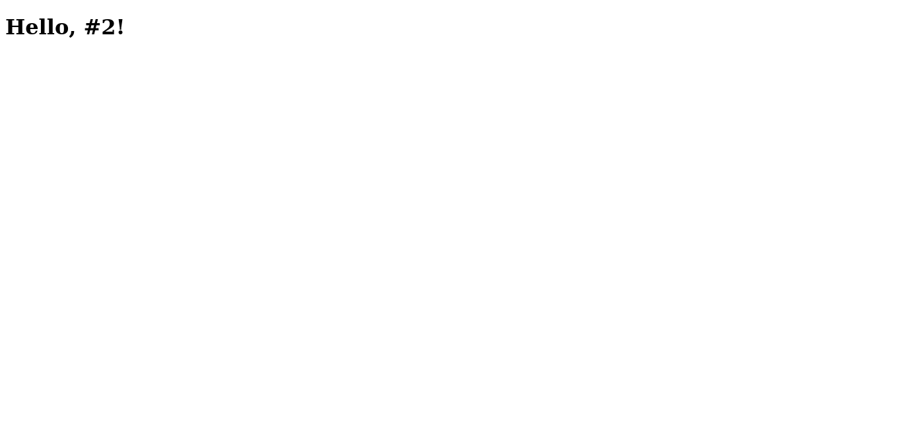

# Set up a "Hello world" project with two apps


> App frontend



## Built With

- React & Redux

## Getting Started

To get a local copy up and running follow these simple example steps.

### Prerequisites

- NodeJS - [v16.x](https://nodejs.org/en/)
- Yarn

### Setup

```bash
git clone https://github.com/usmansbk/hello-react-front-end.git
cd ./hello-react-front-end
```

### Install

```bash
yarn
```

### Usage

```bash
yarn start
```

## Author

👤 **Babakolo Usman Suleiman**

- GitHub: [@usmansbk](https://github.com/usmansbk)
- LinkedIn: [LinkedIn](https://www.linkedin.com/in/usman-suleiman-82b444140/)

## 🤝 Contributing

Contributions, issues, and feature requests are welcome!

Feel free to check the [issues page](../../issues/).

## Show your support

Give a ⭐️ if you like this project!

## Acknowledgments

- Microverse

## 📝 License

This project is [MIT](./LICENSE.md) licensed.
